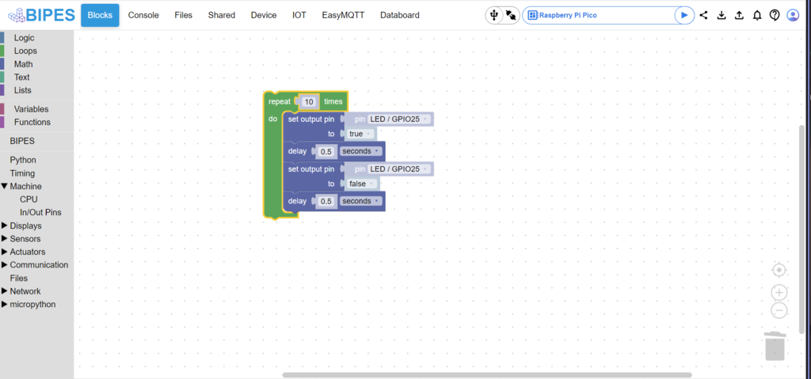
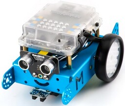
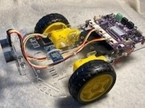

A set of blocks that toggles the on board LED on for half of a second and off for half a second ten times.

**Introduction**

BIPES (Block based Integrated Platform for Embeded Systems) is an application that enables people to program microcontrollers like the Raspberry Pi Pico
without learning MicroPython.  For our purposes, it allows us to teach the concepts of programming, without first diving into the complexities of syntax.
A future state will allow us the extend the application to control our $20 "OptumBot".  

Before jumping into BIPES, I thought I would share how I got to this project.  Like most of my midnight projects lately, it started with an offer to do
something else.  I attended one of the Optum STEM meetings and it was brought up that the team was looking to better document the mBot section of the
robotics CoderDojoTC site.  Of course, before I could help with that, I had to get an mBot (shown on the left).  I ordered the bot and it arrived a day
later.  I put the bot together (a very nice kit, BTW) and downloaded the mBot no code development software.

 

I thought to myself that it would be pretty neat if we had something similar for our $20 Maker Pi RP 2040 based bot kit (the "OptumBot" shown on the above
right) that is now being used by our students. A fun midnight project, right...

**But first...**

I thought that I should at least look online to see if there was anything I could use that would aid in my project.  A quick Google search found BIPES.
An entire eco system that did most of what I wanted.  I was excited to see that the online version of BIPES had support for the Raspberry Pi Pico and
that an off-line version could be built (and customized for our needs).  I found a few issues with the online version that supported the Raspberry
Pi Pico:

- There was an error in the pin definition for pin 4, causing the selection to show the Internal Temp Sensor.
- The NeoPixel display was excluded from the list of displays available.
- The library for the SSD1306 OLED display was missing some of the functions I wanted.
- The library used for the ultrasound sensor was not the same one referenced, and the code didn't use the library.
- Sounds and music were excluded from the list of outputs (and it didn't properly call the PWM function).

**Time to build the off-line version**

I work on a PC.  The Makefile is set up for UNIX.  I thought to download a version of Make for DOS.  That didn't work.  Next, I tried using CYGWIN.  Got
closer, but it doesen't have make built in.  I opened a CYGWIN window and copied the section of the Makefile that I needed.  Close, but still not quite. 
CYGWIN didn't recognize the variable used in the for loop, creating garbage in my index_offline.html file.  I broke apart the loop and tried again.
Success (sort of).  I had a semi-functional copy of the online site, but I got an error message telling me that some of the boards didn't have definations.
Oh well, I didn't need those boards anyway, so I modified my newly created index_offline.html file and removed all of the boards from the option list
except the Raspberry Pi Pico.  In the future, perhaps I'll try the Linux subsystem for Windows so I can run the Makefile as intended.

**How does this work anyway?**

I started to add the blocks I wanted to the Raspberry Pi definition file (rpi_pico.xml) now that I had a copy of the application that ran on my laptop. 
Then I copied the blocks back to the index_offline.html file so I wouldn't have to rebuild it using my limited UNIX scripting ability.  I started to play
with the application to see what it could do.  The first set of tasks was to run through the different labs I set up for my students.  Interrupts seemed
a little flakey, but worked well enough to get the point across; however, I ran into a snag when I tried to load the SSD1306 display library.  I got a 
CORS error!  CORS (Cross-Origin Resource Sharing) errors were caused because my local application was trying to read a file on a remote server.  No 
problem, I could point the request to a local directory, and that should fix the problem, right?  Not quite.  It seems that isn't allowed either, 
since the application is making a non-user call back to the operating system.   I tried to add credentialling to the call, but that still didn't 
resolve the problem.  It turns out there is an extension for Chrome that allows the browser to bypass the CORS error and retrieve the file from a 
remote server.  I didn't want to enable the extension, since I was worried that would expose a security hole in my browser and I really wanted to have 
students download my version of BIPES without making changes to their environment.  I read a lot of web pages (thank you Google), spoke to our on-premise 
javascript guru, and decided that I didn't like the options that were available.  The alternatives seemed to be use the Chrome extension or set up a 
local server to serve the files as needed.

**Enter the Blob(s)**

Another option was to look at the library file, convert it to a Blob, then use FileReader to load the Blob and transfer the library to the device. 
Fortunately, UltraEdit made quick work of converting the library file and I thought I was in business.  Except, the SSD1306 library file didn't support some
of the functions that I wanted (scroll & line), plus I wanted to add rect and fill_rect blocks to the available function list for the display.  I know 
the SSD1306 library supported those functions, so I used the library that was available through Thonny.  It was slightly different then the library that 
BIPES had (their version was ported from an Adafruit library).  I got the Blob functionality to work and was ready to go.  Except there were other files 
to convert.  I created a pylibsBlobs folder to hold my newly created "blobified" files.  

**Adding new blocks**

I mentioned that I wanted to draw lines using the SSD1306 built in functions.  It was all well and good to update the library, but now I had to add the 
code to generate the appropriate block.  I also wanted to add a rectangle and filled rectangle block.  That was accomplished by adding to the 
block_definition.js file.  Following the blockly framework, I associated the block with the code that I wanted to generate.  Then I added a field that
showed what the block(s) would do as well as additional fields for the inputs as needed.  Finally, I followed the defined convention for setting the
color of the blocks.  Once I figured out how these files,rpi_pico.xml, generate_stubs.js, and block_definitions.js file, played together, the relationship
became evident.  The rpi_pico.xml file creates the block with its default values for the microcontroller.  The block_definitions.js file defines the
text describing the block, the names of the inputs, and the color of the block.  The generate_stubs.js file ties the MicroPython code back to the block.

**What else changed?**

Now that I had a working application that would run offline in my browser, I wanted to update the Makefile so that the online version would work as
designed, pulling files from the server and the offline version would work, pulling files from the blobs I built.  I added a function to the offline build
that would only be loaded as part of the index_offline.html file.  Then I modified the code.js and utils.js files to detect if that function existed.  
If it did, the application would load the files from the local pylibsblob folder, otherwise, it would load the files from the online pylibs folder, 
as originally designed.

**What's next?**

I want to add the MakerPiRP2040 board into the application.  That requires adding a new file into the toolbox folder as well as adding the board to the 
options in the index_offline.html file.  I want to add some of the motion commands (forward, back, turn left, turn right) so the MakerPiRP2040
based bot can be driven.  Finally, the MakerPiRP2040 board should have all of the same blocks as the Raspberry Pi Pico board.

