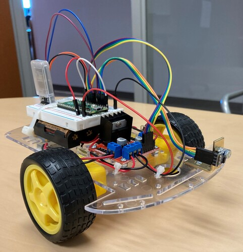
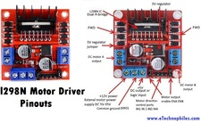
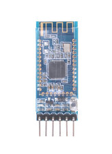
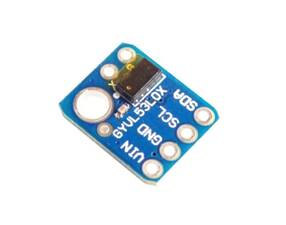
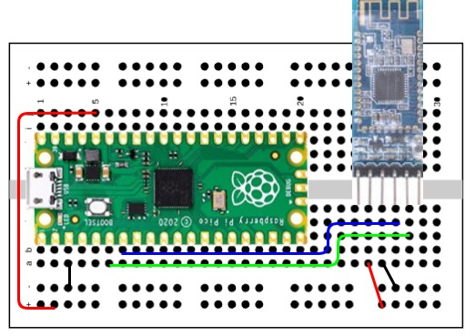
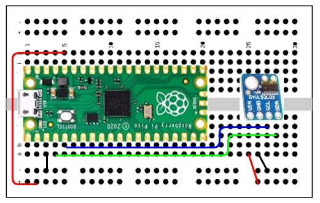
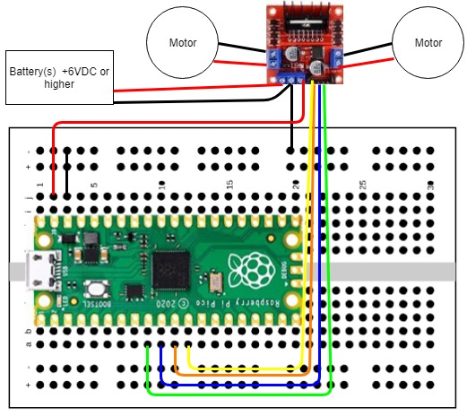

# Building a remote control robot car with the Raspberry Pi Pico


 This was the first robot car that I built, after learning about the Pico.

 The Rasperry Pi Pico is a cheap (only $4), tiny, fast, and versatile board built using RP2040, a  microcontroller chip designed by Raspberry Pi.

  https://www.raspberrypi.com/products/raspberry-pi-pico/

 **Additional Parts required ($15 - $20, depending on sources):**

 Description | Part 
---------|----------
Chassis kit | 
L298N motor driver board | 
HM-10 Bluetooth module | 
VL53L0X Time of Flight sensor | 
#4-40 Nuts and bolts
Small angle bracket
Wire ties to secure wires and the breadboard
Four AA batteries

 **Additional software required:**
- Software capable of connecting to and writing to the HM-10 bluetooth module (I'm using LightBlue)

 **Driver for the VL53L0X Sensor**
- https://github.com/kevinmcaleer/vl53lx0

**There are several parts to this project.  Let's break them down by tasks:**

- Communicate with the bluetooth module
- Get data from the Time of Flight sensor
- Assemble the chassis 
- Drive the motors with the Motor Driver board
- Putting it all together

**Communicate with the bluetooth module**

The HM-10 bluetooth module communicates at 9600 baud by default, although some older modules use 115200 baud.  Communication is done through the built in UART in the Pico.  The settings (baud rate, name, etc.) can be changed by sending AT commands to the module.  Sending "AT+HELP" to the module will return a list of supported commands.

The AT commands for getting/setting baud rate are:

Send | Receive | Parameter
---------|----------|---------
 AT+BAUD? | OK+Get:[P1] | P1: Baud Rate
 AT+BAUD[P1] | OK+Set:[P1] | 0: 9600; 1: 19200; 2: 38400
 . |  | 3: 57600; 4: 115200; 5: 4800
 . |  | 6: 2400; 7: 1200; 8: 230400
 . |  | Default: 0 (9600)

The pins are usally labelled on the back of the module.  Your module with either have six or four pins.  Ignoring the outmost pins (assuming your module has six pins), the pins from left to right as you look at the front of the board are VCC (3.3 VDC from the Pico), Gnd, Tx, & Rx.  Connect the Tx pin to UART1 Rx pin and the Rx pin to UART1 Tx pin.  Using the following code and your bluetooth application of choice, you should be able to send data to the Pico and have it display in the terminal window.



This is the code:
```
from machine import Pin, UART

def readUartBytes(uart):
    resp = b""
    if uart.any():
        resp = b"".join([resp, uart.read(1)])
    return (resp.decode())
 
# Create the UART
uart1 = UART(id=1, baudrate=9600, tx=Pin(4), rx=Pin(5))

# Loop
while True:
    data = str(readUartBytes(uart1)).lower()
    if data != "":
        print(data)
```
**Get data from the Time of Flight sensor**

The Time of Flight sensor communicates through an I2C interface.  The driver for the device can be downloaded through Thonny or is available through git at the link provided above.  Depending on the IDE used, the driver will be automatically uploaded to your Pico (via Thonny) or you need to load it to the lib folder on your Pico manually.  For our purposes, we'll convert the measurement to inches.



```
from machine import Pin, I2C
from vl53l0x import VL53L0X
import time # sleep

i2cToF = I2C(1, sda=Pin(2), scl=Pin(3), freq=400000)
tof = VL53L0X(i2cToF)

while True:
    measureMM = tof.ping() - 25
    measureIn = round(measureMM / 25.4, 2)
    print("Distance: " + str(measureIn) + " inches")
```

**Assemble the chassis**

Follow the directions for assembling the chassis.  Take care when connecting the wires to the motors, since the leads on the motors are easily proken.  Once the chassis is assembled, add the motor driver to the chassis and wire it to the motors.  Secure the motor driver to the chassis using screws (or glue).

**Drive the motors with the Motor Driver board**

The motor driver board has an onboard voltage regulator that converts the input voltage (up to 12 VDC) to 5VDC for the Pico.  It sends the un-converted voltage to the motors, with the polarity based on the control inputs.  Note that your wiring maybe slightly different, depending on how the motors are wired.  Make sure that the left ond right wheels  turn forward and backward as desired when running the test code below. 



```
from machine import Pin, PWM
from time import sleep

RIGHT_FORWARD_PIN = 7
RIGHT_REVERSE_PIN = 6
LEFT_FORWARD_PIN = 9
LEFT_REVERSE_PIN = 8

right_forward = PWM(Pin(RIGHT_FORWARD_PIN))
right_reverse = PWM(Pin(RIGHT_REVERSE_PIN))
left_forward = PWM(Pin(LEFT_FORWARD_PIN))
left_reverse = PWM(Pin(LEFT_REVERSE_PIN))

POWER_LEVEL = 65025

def spin_wheel(pwm):
    pwm.duty_u16(POWER_LEVEL)
    sleep(2)
    pwm.duty_u16(0)
    sleep(1)

while True:
    print('right forward')
    spin_wheel(right_forward)
    
    print('right reverse')
    spin_wheel(right_reverse)
    
    print('left foward')
    spin_wheel(left_forward)
    
    print('left_reverse')
    spin_wheel(left_reverse)
```

**Putting it all together**

Now that all the individual parts have been tested, you should be able to put them all together.  The final code is below.  Note that the control wiring for the motors is different in the code below than the code above.  You may have to adjust in order for your robot car to move as desired. 

 _Happy motoring!_


```
from machine import Pin, PWM, UART, I2C
from vl53l0x import VL53L0X
import time # sleep

POWER_LEVEL = 65025

RIGHT_FORWARD_PIN = 7
RIGHT_REVERSE_PIN = 6
LEFT_FORWARD_PIN = 9
LEFT_REVERSE_PIN = 8

right_forward = PWM(Pin(RIGHT_FORWARD_PIN))
right_reverse = PWM(Pin(RIGHT_REVERSE_PIN))
left_forward = PWM(Pin(LEFT_FORWARD_PIN))
left_reverse = PWM(Pin(LEFT_REVERSE_PIN))

uart1 = UART(id=1, baudrate=9600, tx=Pin(4), rx=Pin(5))

i2cToF = I2C(1, sda=Pin(2), scl=Pin(3), freq=400000)
tof = VL53L0X(i2cToF)

def stopWheels(leftFwdPWM,rightFwdPWM,leftRevPWM,rightRevPWM):
    leftFwdPWM.duty_u16(0)
    rightFwdPWM.duty_u16(0)
    leftRevPWM.duty_u16(0)
    rightRevPWM.duty_u16(0)

def spin_wheels(leftPWM, rightPWM):
    leftPWM.duty_u16(POWER_LEVEL)
    rightPWM.duty_u16(POWER_LEVEL)

def readUartBytes(uart):
    resp = b""
    if uart.any():
        resp = b"".join([resp, uart.read(1)])
    return (resp.decode())

dir = "s"

while True:
    newDir = str(readUartBytes(uart1)).lower()
    if newDir != "":
        dir = newDir
        stopWheels(right_forward, left_forward, left_reverse, right_reverse)

    measureMM = tof.ping() - 25
    measureIn = round(measureMM / 25.4, 2)

    if measureIn < 4:
        stopWheels(right_forward, left_forward, left_reverse, right_reverse)
        spin_wheels(left_reverse, right_reverse)
        time.sleep(.25)
        dir = "s"

    if dir == "f":
        spin_wheels(left_forward, right_forward)

    if dir == "b":
        spin_wheels(left_reverse, right_reverse)

    if dir == "l":
        spin_wheels(left_reverse, right_forward)

    if dir == "r":
        spin_wheels(left_forward, right_reverse)

    if dir == "s":
        stopWheels(right_forward, left_forward, left_reverse, right_reverse)

```
