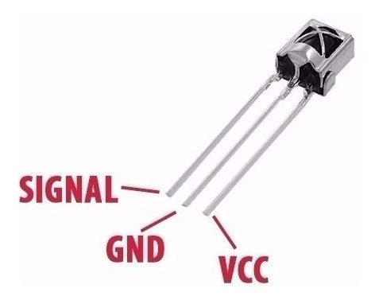

# Working with an IR sensor


I wanted to update my bot to use an IR sensor so I could drive it with an IR remote.  The IR sensors are much cheaper than the bluetooth module that I am currently using.  Additionally, I thought I could move away from bluetooth modules that were specific to phone types.  It seemed simple enough, until it wasn't.

First things first, I ordered a set of IR sensors from [Amazon](https://www.amazon.com/gp/product/B071976MZ8/ref=ppx_yo_dt_b_asin_title_o02_s00?ie=UTF8&psc=1).  These receivers use the standard 38KHz carrier frequency and are widely used in a variety of AV equipment, so they seemed like a good choice.

Next up, find a library on git, so I don't have to write my own code to work with the modules.  A little searching led me to Peter Hinch's [micropython ir repo](https://github.com/peterhinch/micropython_ir).  I cloned the repo and moved the IR receiver code over to my RP2040 board.

I connected the sensor, and then tried the python test code as documented in Peter's notes:

```
from ir_rx.acquire import test
test()

``` 
Boom!  The code blew up with an error message that the array module didn't exist.  I looked to ensure I had the latest uf2 release installed on my board (I did - version 1.17).  Then I looked to see if I could find any documentation on why arrays were not supported in micropython (they were).  So I dug further and found some notes that v1.13 had support for arrays, but it seemed to fall out of v1.14.  I had various versions of the uf2 files from 1.14 forward.  So no luck there; however, one of the responses noted that the nightly builds had support for arrays.  I found the [micropython site](https://micropython.org/download/rp2-pico/) that had the nightly builds for the RP2040 and was able to use [v1.17-231-g0892ebe09 (2021-12-13) .uf2](https://micropython.org/resources/firmware/rp2-pico-20211213-unstable-v1.17-231-g0892ebe09.uf2).  While the build is marked as unstable, it had the support I needed for arrays and seems to work without issue.

Looked like I was good to go, until once again, I hit a snag.  The TV remotes in my house are for Samsung TVs.  They operate with a 38KHz carrier, but were not supported by the library :-(  Reading further, I found that I could spend a lot of time decoding the data that I was seeing from the test code, or I could buy a remote that used the NEC protocol, as suggested in Peter's notes.  The remote he suggested was available from [adafruit](https://www.adafruit.com/product/389) at a reasonable price, but the shipping was as expensive as the remote.  I ended up purchasing two remotes with sensors from [Amazon](https://www.amazon.com/gp/product/B07S67SFSF/ref=ppx_yo_dt_b_asin_title_o01_s00?ie=UTF8&psc=1).  The reviews for the sensors were mixed, but I didn't care.  The remotes were NEC compatible.

I'm looking forward to testing the sensors on my bot once the remotes arrive.

A quick update: Decoding the Samsung remote was not as complicated as I thought after I found and read this [blog post](http://arduinostuff.blogspot.com/2011/06/samsung-remote-ir-codes.html).  Basically, once the data is read, there is a stop bit, followed by a data stream, followed by a stop bit.  I created a new class for the Samsung remote and sent an update to Peter.  In case he doesn't accept it, you can find my repo [here](https://github.com/jetannenbaum/micropython_ir).  The samsung.py file can be found in the ir_rx folder.  Before going down that path, make sure to read the RECEIVER.md file carefully.  The sample driver is for the NEC remote and the Pyboard hardware.  Here is the driver to test the samsung remote:

```
import time
from machine import Pin
from ir_rx.samsung import SAMSUNG  # SAMSUNG remote

led = Pin(25, Pin.OUT)

def callback(data, addr, ctrl):
    if data > 0:
        print("0x%X" % data)

ir = SAMSUNG(Pin(16, Pin.IN), callback)
while True:
    time.sleep_ms(1000)
    led.toggle()

```