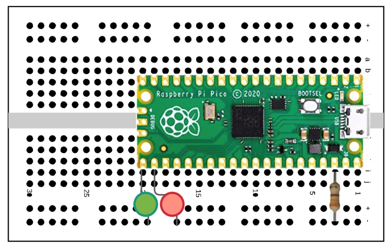

# Second Class

## Soldering Headers

The soldering irons arrived with a small stand, a small sponge, and some solder.  I'm used to 60/40 solder/rosin core.  This solder was something else.  It had a high melting point and the soldering irons were barely able to melt the solder at the highest settings.  Fortunately, the teacher had some solder that was usable.  The students spent some time soldering, although some were more successful than others.  Another leason learned, make sure to buy or have on hand high quality solder.   After 30 minutes, the students who did not complete soldering their headers ont the board switched to pre-soldered boards.

## Finally, the first lab

The first lab was a combination of making sure Thonny was installed, had the right Micropython configuration loaded for the pico, could communicate with the board, and run a simple application, blinking the onboard LED.  The students struggled a bit with the Thonny configuration.  A graphic of how to change the default configuration would have been more helpful (my slide had the words, but not the associated image).  I have to keep remembering that just because something is natural for me, as an experienced developer, it isn't quite as easy for someone who is newly learning.  Eventually, all of the students were able to configure Thonny and get the onboard LED to blink.  Once they had code working, I asked them to save their code to a github account so they could retrieve it later.  The laptops they were using were specific to the classroom we were in, so they may not have the same laptops for each session.

## The second lab

This lab built on the first one.  The students added two LEDs and a current limiting resistor to the board with the pico as shown below.

 

 We had a discussion about which lead of the LEDs should be connected to the board (Hint: it was the longer lead) and which lead should go to the common rail.  The students were able to make the LEDs blink on and off in an alternating sequence.  Once they mastered that task, several students added additional LEDs (they had the option to add four LEDs to the board) and had a sequence of blinking LEDs.
 