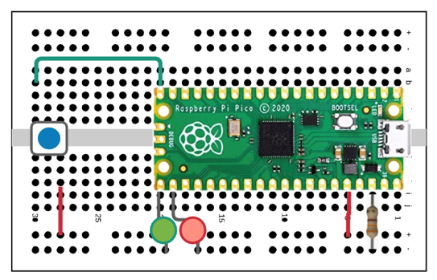

# Third Class

## Catching Up

This class was my first remote session.  I had hoped that we had all of the kinks ironed out, but a new one came up.  Students that missed last week's class wanted to catch up.  Unfortunately, this meant that they had to go through getting their environment setup, getting the latest UF2 file installed (at least they didn't spend time soldering headers - still had a few boards ready to go), and quickly run through the second lab.  I spoke to the instructor afterwards and we agreed that in the future he would run a makeup class the day before the regularly scheduled class.

## Reading a button press.

Now that the students figured out how to send data out the GPIO pins, it was time to read data back.  The lab scenario this time was that a button press was required to toggle the LEDs.  The setup is below.

The first part of the lab was simply changing the code to check for a button press inside of a loop.  If the button was pressed, toggle the LEDs.  We talked about the microprocessor sitting in a loop, waiting for the student to press the button.  I described it as waiting for an email or text message from a friend and constantly looking at their phones, waiting to see if there was a response.  Everyone agreed that wasn't the best way to look for a message.  What if the device had a way to signal when a new message arrived, just like their phone did?  This led to a discussion of how an interrupt handler worked.  I walked the students through the concept, staying with the phone analogy.  The code was a little harder to comprehend, since it requires an explanation of interrupt handlers, but the students were able to update their code and see the results before the end of our time together.
 